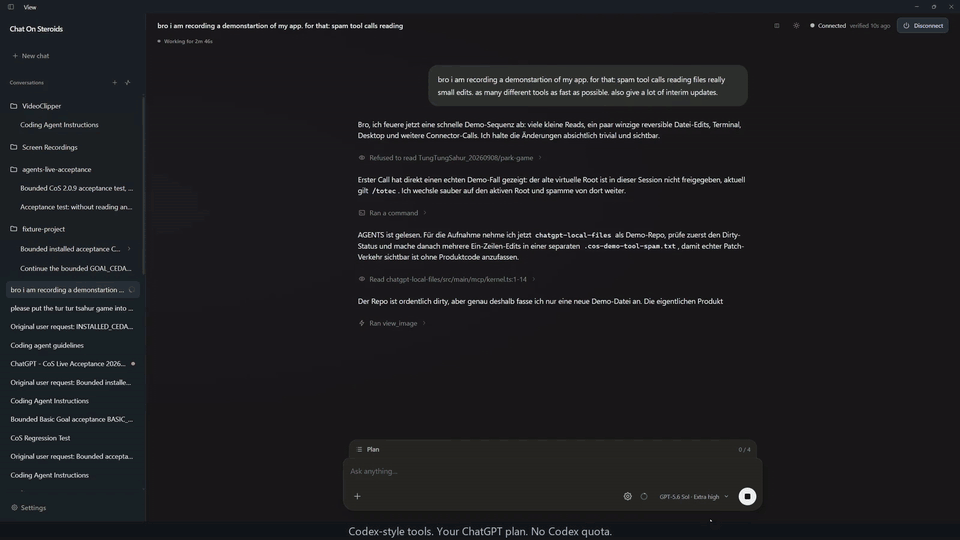
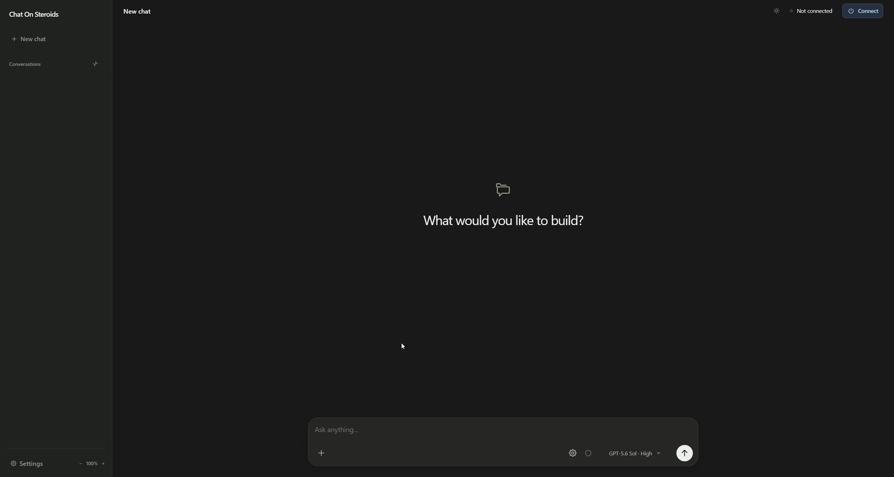
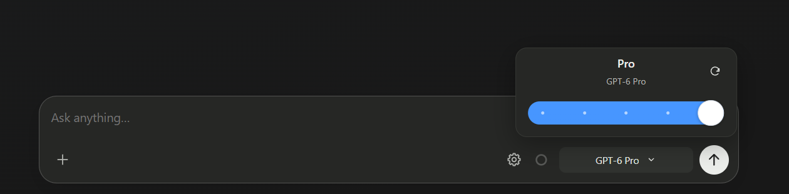
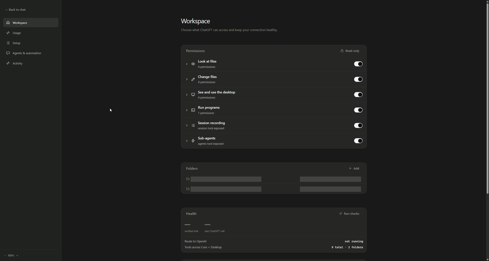

# Chat On Steroids

**Your ChatGPT plan. A workspace that gets things done.**

Give ChatGPT a project folder. Let it read and edit files, run commands, use your desktop and delegate to workers — while you follow the work and steer it from one app.

<p>
  <a href="https://github.com/totec448-spec/chat-on-steroids/releases/latest/download/Chat-On-Steroids-Setup-x64.exe"></a>
  <a href="https://github.com/totec448-spec/chat-on-steroids/releases/latest/download/Chat-On-Steroids-macOS-arm64.dmg"></a>
  <a href="https://github.com/totec448-spec/chat-on-steroids/releases/latest/download/Chat-On-Steroids-Linux-x64.deb"></a>
</p>

[Windows ARM64](https://github.com/totec448-spec/chat-on-steroids/releases/latest/download/Chat-On-Steroids-Setup-arm64.exe) · [Intel Mac](https://github.com/totec448-spec/chat-on-steroids/releases/latest/download/Chat-On-Steroids-macOS-x64.dmg) · [Linux ARM64](https://github.com/totec448-spec/chat-on-steroids/releases/latest/download/Chat-On-Steroids-Linux-arm64.deb) · [All downloads](#download)

<p><a href="docs/images/demo.mp4"></a></p>

[Watch the 10-second video](docs/images/demo.mp4) · [Setup guide](#quick-start) · [Plugins](docs/plugins.md) · [Changelog](CHANGELOG.md)

## From a prompt to working code

- **Work in your project.** Read files, apply edits, run tests and keep terminals alive between tool calls.
- **See what happened.** Follow the plan, file changes and real tool results in a single conversation history.
- **Steer while it works.** Inject a correction or queue the next instruction without losing the original task.
- **Split the work.** Give separate jobs to reusable worker chats. They sleep when finished and keep their context for the next task.
- **Keep going.** Goal follows unfinished work to completion. Loop continues within your brief until you switch it off.
- **Carry the context forward.** Compact & Resume moves work into a fresh ChatGPT conversation while keeping the local session, task and worker history.

The model runs in **your ChatGPT conversation**, using the models and reasoning levels available to your account. CoS supplies the local tools and workspace; it does not consume Codex quota. ChatGPT's usage and context limits still apply.

<details>
<summary><strong>See the workspace, model picker and settings</strong></summary>

### Workspace



### Model picker



### Settings



</details>

## Quick start

1. **Install and open CoS.** Choose the download for your operating system and CPU.
2. **Choose what ChatGPT may access.** In **Settings → Workspace**, approve a project folder and review the tool permissions.
3. **Connect the local tools.** Configure a tunnel in **Settings → Setup**, press **Connect**, then add the **Core** app in ChatGPT's Developer mode.
4. **Load the companion extension.** Press **Open extension folder**. In `chrome://extensions`, enable Developer mode, choose **Load unpacked** and select that folder. Pairing is automatic.
5. **Start a task.** Choose a project and model in CoS, write your request and send it.

Want screen and keyboard control? Enable **Desktop** permissions and connect its separate app. On macOS, also grant Screen Recording and Accessibility in System Settings.

**After an update:** reload the companion extension and refresh the CoS apps in ChatGPT when prompted. These are two separate steps.

<details>
<summary><strong>Tunnel setup</strong></summary>

### OpenAI Secure MCP Tunnel

1. Create a tunnel in [Platform → Tunnels](https://platform.openai.com/settings/organization/tunnels), in the same workspace you use in ChatGPT.
2. Create a **Restricted** [API key](https://platform.openai.com/settings/organization/api-keys) with **Tunnels: Read** and **Tunnels: Use**.
3. Enter the tunnel ID and key in CoS and press **Connect**.
4. In ChatGPT, enable Developer mode under **Settings → Apps → Advanced settings**, then create a custom app of type **Tunnel**. Review and enable its actions.

Core, Desktop and Plugins are separate connectors. Configure each surface you enable. Release packages include the pinned, checksum-verified `tunnel-client`.

### Other tunnels

**Cloudflare quick tunnel:** connect in CoS and use the displayed public URL as the MCP server URL in ChatGPT. The random path is a secret and changes on restart.

**Your own HTTPS tunnel:** forward to the loopback URL shown by CoS and preserve its secret path. Treat the resulting URL like a password.

</details>

## Download

| Platform | x64 | ARM64 |
| --- | --- | --- |
| **Windows** | [Installer](https://github.com/totec448-spec/chat-on-steroids/releases/latest/download/Chat-On-Steroids-Setup-x64.exe) | [Installer](https://github.com/totec448-spec/chat-on-steroids/releases/latest/download/Chat-On-Steroids-Setup-arm64.exe) |
| **macOS** | [DMG](https://github.com/totec448-spec/chat-on-steroids/releases/latest/download/Chat-On-Steroids-macOS-x64.dmg) · [ZIP](https://github.com/totec448-spec/chat-on-steroids/releases/latest/download/Chat-On-Steroids-macOS-x64.zip) | [DMG](https://github.com/totec448-spec/chat-on-steroids/releases/latest/download/Chat-On-Steroids-macOS-arm64.dmg) · [ZIP](https://github.com/totec448-spec/chat-on-steroids/releases/latest/download/Chat-On-Steroids-macOS-arm64.zip) |
| **Linux** | [DEB](https://github.com/totec448-spec/chat-on-steroids/releases/latest/download/Chat-On-Steroids-Linux-x64.deb) · [AppImage](https://github.com/totec448-spec/chat-on-steroids/releases/latest/download/Chat-On-Steroids-Linux-x64.AppImage) | [DEB](https://github.com/totec448-spec/chat-on-steroids/releases/latest/download/Chat-On-Steroids-Linux-arm64.deb) · [AppImage](https://github.com/totec448-spec/chat-on-steroids/releases/latest/download/Chat-On-Steroids-Linux-arm64.AppImage) |

[Companion extension](https://github.com/totec448-spec/chat-on-steroids/releases/latest/download/Chat-On-Steroids-Extension.zip) · [Checksums](https://github.com/totec448-spec/chat-on-steroids/releases/latest/download/SHA256SUMS.txt) · [Native library sources](https://github.com/totec448-spec/chat-on-steroids/releases/latest/download/Chat-On-Steroids-Native-Sources.tar.gz) · [Release notes](https://github.com/totec448-spec/chat-on-steroids/releases/latest)

**Requirements:** Windows 10/11, macOS 13 Ventura or newer, or a current desktop Linux; Chrome 116+ or current Microsoft Edge; and a ChatGPT account/workspace with Developer mode and custom MCP apps. Check [OpenAI's availability guide](https://help.openai.com/en/articles/12584461-developer-mode-and-mcp-apps-in-chatgpt) for your account.

**Unsigned beta:** Windows builds are not publisher-signed. macOS builds are publisher-unsigned and unnotarized. Verify the download against `SHA256SUMS.txt` before installing.

<details>
<summary><strong>Installation notes, checksums and updates</strong></summary>

- **Linux:** prefer the DEB on Debian/Ubuntu. On systems that disable unprivileged user namespaces, the AppImage launcher can fall back to `--no-sandbox`. Use the DEB if you do not want that fallback. A working Secret Service keyring, such as GNOME Keyring or KWallet, is required for credential storage.
- **Edge:** select it under **Settings → Browser & history → ChatGPT browser**, then load the companion at `edge://extensions` in your signed-in profile.
- **Updates:** Windows and AppImage builds check for releases, verify downloaded checksums and install when you quit or choose **Install update**. macOS and DEB builds link to the release page for manual updates.
- **API keys:** the coding conversation uses ChatGPT. A restricted tunnel key is needed for the Secure MCP Tunnel setup. OpenRouter or a custom API key is optional, for API-backed plans and Goal/Loop decisions.

```powershell
Get-FileHash .\Chat-On-Steroids-Setup-x64.exe -Algorithm SHA256
```

```sh
shasum -a 256 Chat-On-Steroids-macOS-arm64.dmg
sha256sum Chat-On-Steroids-Linux-x64.AppImage
```

</details>

## Tools, on your terms

| Connector | What it adds |
| --- | --- |
| **Core** | Local files, patches, terminals, generated-file downloads, session history, plans and workers. Available on all supported platforms. |
| **Desktop** | Screen inspection, mouse, keyboard and clipboard. Windows and macOS; macOS requires explicit enablement and OS permissions. |
| **Plugins** | External MCP tools such as Blender, Playwright and Memory, plus custom local or remote servers. [Plugin guide](docs/plugins.md). |

You choose the approved folders and capabilities. File tools enforce those roots; shell commands run with your normal user privileges. Desktop access applies to the desktop, and external plugins have their own permissions. **Read-only mode** disables writes, command execution and desktop control.

History is stored locally, with recording on and 30-day retention by default. Credentials use the operating system's secure storage. Review permissions before connecting: fresh installs enable Core capabilities and two workers; Windows also starts with Desktop permissions enabled.

[Security policy](SECURITY.md) · [Tool reference](docs/tool-surface.md) · [Architecture](AGENTS.md)

<details>
<summary><strong>Sessions, workers and Astra</strong></summary>

**Session history** belongs to the local session, not a particular ChatGPT tab. The companion records messages and the actual local tool results so the app and the model can read earlier work.

**Compact & Resume** asks for a handoff, starts a fresh provider conversation and rebinds that same session. Task and worker history move with it. Automatic compaction uses configured local estimates and eligible live work; Pro models never auto-compact.

**Workers** keep their conversation when they finish. Send a follow-up to reuse one. The default is two simultaneous workers per family, configurable up to eight. Idle owned tabs can be reused or closed after fresh checks; the durable worker history remains. Drafts, active work and pins are protected.

**Goal** can decide the task is complete and send nothing. **Loop** continues within the brief until disabled. Both support ChatGPT helpers or an optional API backend.

**Astra's finish boundary** can receive queued instructions, plan checkpoints and automatic follow-ups through tools within the same working turn when Session finish is enabled. You can end the turn from the composer. This does not remove provider usage or context limits.

</details>

<details>
<summary><strong>Troubleshooting</strong></summary>

- **Missing or stale tools:** refresh the relevant CoS app in ChatGPT. Reloading the Chrome extension is a separate action.
- **Extension version mismatch:** reload the unpacked companion after updating CoS, then reload the ChatGPT page.
- **Models missing:** use **Reload ChatGPT models**. The picker reflects availability in your signed-in account.
- **`UNIDENTIFIED_CALLER`:** use that conversation in the paired browser so the extension can prove its request identity. CoS does not guess from the active tab.
- **`COMPACTION_IN_PROGRESS`:** let the source chat finish its handoff. Work continues in the replacement conversation.
- **Linux credential storage unavailable:** unlock GNOME Keyring or KWallet, then restart CoS.
- **A chat will not stop:** **Block** revokes local tools for that exact conversation. It does not claim to cancel the provider's generation.

The MCP connector uses ChatGPT's Developer mode and tunnel interfaces. The companion also observes and automates the browser UI; this is not a public ChatGPT automation API. Your account's [terms and policies](https://openai.com/policies/) apply. Do not use it to evade limits or safety controls.

</details>

<details>
<summary><strong>Build from source and contribute</strong></summary>

## Development

```sh
npm ci
npm run dev
npm run verify
```

Read [AGENTS.md](AGENTS.md) before changing the app and [CONTRIBUTING.md](CONTRIBUTING.md) before opening a PR.

## Building

```sh
npm run dist:x64          # Windows x64
npm run dist:arm64        # Windows ARM64
npm run dist:mac:x64      # macOS Intel
npm run dist:mac:arm64    # macOS Apple silicon
npm run dist:linux:x64    # Linux x64
npm run dist:linux:arm64  # Linux ARM64
```

Build on the target OS. The release workflow uses native runners for all six targets, checks the packaged runtimes and assembles the complete artifact set with checksums and corresponding native library sources.

</details>

---

[MIT licensed](LICENSE). Not affiliated with or endorsed by OpenAI. ChatGPT and Codex are OpenAI trademarks.
